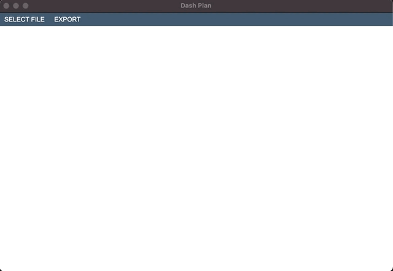
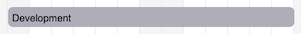
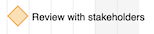
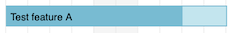
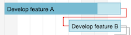

# Dash Plan

A minimal Gantt Viewer based on simple gantt definitions on yaml files.

## Usage

We use simple and clear yaml files to express the structure of the Gantt chart.

To open a gantt chart simply click on `SELECT FILE` and find the yaml file of your Gantt chart.



**NOTE:** Try using this sample gantt chart [file](samples/sample-gantt.yml).

## File format

### Boilerplate

To start creating a Gantt chart for **Dash Plan** you should start creating the base structure of the file.

It consists in defining your `gantt` and its `label` that defines the name of your project.

```yml
gantt:
  label: Sample Project
  items:
    ...
```

### Items

`items` is a list of any type of item inside of a gantt chart.

Every time you see the `items` property, you can add items of the following types:

* Section
* Task
* Milestone

When you define an `item`, it is automatically inferred to be a **Task** unless you define its type using the `type` property:

```yml
- type: section
  label: Development
```

### Item properties

#### Type

```yml
type: section
```

Define the type of an item. It can be `section`, `task` or `milestone`. If this property is not defined the default value is `task`

##### Section



Section represents a group of items insede your Gantt chart. Usually used to describe phases of a project.

##### Milestone



Milestone represent a significant change or stage of a project.

##### Task



Represents the tasks of the project.

#### Id

> available types: `section`, `task`, `milestone`

```yml
id: 1
```

```yml
id: TSK-1
```

Id is a property that defines a unique identifier for an item. The `id` is used to reference the item in other items definition

#### Label

> available types: `section`, `task`, `milestone`

```yml
label: Development
```

#### Progress

> available types: `task`

```yml
progress: 80
```

The progress property is used when you want to express how much of the work is done for a give task.
It is expressed by a percent number, it must be a value between 0 and 100.

#### Dependency

> available types: `task`, `milestone`

```yml
depends_on:
  - 2
  - 3
```

```yml
depends_on: 1
```

Represents the dependency between items. The value of this property can be an id of an item or a list of item ids.

The dependencies are represented as connecting lines in the chart visualization. If the dependent item starts before the end of the item it depends on, the line is red.



#### Start and end dates

##### Simple start and end dates

The start and end dates of an item can be simply defined by the `start` and `end` properties.

```yml
start: 2018-10-01
end: 2018-10-09
```

##### Using start date and duration

If you know the `duration` of an item you can use it instead of the `end` date. Durations can be a number of days (`2`) or a number of business days (`2b`).

```yml
start: 2018-10-01
duration: 2b
```

##### Using start date depending on the end of other item

If you have items that depend on each other, you can use an expression to define the `start` date of the item:

```yml
start: after(4) + 2b
duration: 8b
```

In this exemple, the item will start 2 business days after the end of the item with id `4`.

## Contributing

Pull requests are welcome. For major changes, please open an issue first to discuss what you would like to change.

Please make sure to update tests as appropriate.

### Development setup

```shell
make setup
make run
```

## License
[MIT](https://choosealicense.com/licenses/mit/)